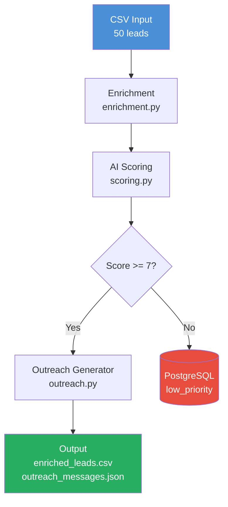

# Code Standards — Senior Stamp

> Every project must meet these standards without exception.
> These differentiate the portfolio from the saturated market.

---

## 1. Project Structure (Every Project)

```
project-N-name/
├── src/
│   ├── __init__.py
│   ├── config.py          # Settings loaded from env vars (pydantic-settings)
│   ├── models.py          # Pydantic data models
│   └── [feature].py       # One file per concern — no God files
├── tests/
│   ├── conftest.py        # Shared fixtures
│   └── test_[feature].py  # Mirror src/ structure exactly
├── data/
│   └── [synthetic files only]
├── n8n/
│   └── workflow.json      # Exportable n8n workflow
├── docker-compose.yml
├── Dockerfile
├── requirements.txt
├── .env.example           # All vars documented, no real values
└── README.md              # Cowork generates
```

---

## 2. Tests (pytest)

Minimum per module:
- 1 happy path test
- 2 edge case tests (empty input, invalid data, boundary values)
- 1 error handling test (what happens when it breaks)

```python
# tests/conftest.py — shared fixtures pattern
import pytest
from unittest.mock import MagicMock
from src.models import Lead

@pytest.fixture
def sample_lead():
    return Lead(
        id="LEAD-001",
        company="Acme Corp",
        contact="Jane Doe",
        email="jane@acmecorp.com",
        industry="SaaS",
        employees=50
    )

@pytest.fixture
def empty_lead():
    return Lead(id="LEAD-002", company="", contact="", email="")

@pytest.fixture
def mock_claude(monkeypatch):
    mock = MagicMock()
    mock.return_value = '{"score": 8, "reasoning": "Strong match"}'
    monkeypatch.setattr("src.scoring.call_claude", mock)
    return mock
```

```python
# tests/test_scoring.py — pattern to follow
def test_score_lead_happy_path(sample_lead, mock_claude):
    result = score_lead(sample_lead)
    assert 1 <= result.score <= 10
    assert result.reasoning is not None
    assert len(result.reasoning) > 0

def test_score_lead_empty_company(empty_lead, mock_claude):
    result = score_lead(empty_lead)
    assert result.score == 0
    assert "insufficient" in result.reasoning.lower()

def test_score_lead_missing_email(sample_lead, mock_claude):
    sample_lead.email = ""
    result = score_lead(sample_lead)
    assert result.score < 5  # penalized for missing contact info

def test_score_lead_claude_failure(sample_lead, monkeypatch):
    monkeypatch.setattr("src.scoring.call_claude", MagicMock(side_effect=Exception("API down")))
    with pytest.raises(ScoringError):
        score_lead(sample_lead)
```

**Run tests:** `pytest tests/ -v --tb=short`
**Never make real API/Claude calls in tests** — always mock.

---

## 3. Error Handling

Never silent failures. Always log + return structured result or raise.

```python
# Pattern: structured result object
from loguru import logger
from src.models import ProcessingResult

def process_document(doc_path: str) -> ProcessingResult:
    """
    Extract structured data from a document.

    Args:
        doc_path: Absolute path to the PDF/document file.

    Returns:
        ProcessingResult with success flag, data or error message.
    """
    try:
        raw = extract_raw(doc_path)
        structured = parse_structured(raw)
        logger.info(f"Document processed successfully: {doc_path}")
        return ProcessingResult(success=True, data=structured)

    except FileNotFoundError as e:
        logger.error(f"Document not found: {doc_path} | {e}")
        return ProcessingResult(success=False, error="Document not found")

    except ExtractionError as e:
        logger.error(f"Extraction failed for {doc_path} | {e}")
        return ProcessingResult(success=False, error=f"Extraction failed: {str(e)}")

    except Exception as e:
        logger.critical(f"Unexpected error processing {doc_path} | {e}")
        raise  # Re-raise unexpected errors — do not swallow them
```

Custom exception classes per project:
```python
# src/exceptions.py
class ScoringError(Exception): pass
class ExtractionError(Exception): pass
class IngestionError(Exception): pass
class RetrievalError(Exception): pass
```

---

## 4. Logging (loguru)

Setup once in `config.py`, import everywhere.

```python
# src/config.py
import os
from loguru import logger
from pydantic_settings import BaseSettings

class Settings(BaseSettings):
    log_level: str = "INFO"
    database_url: str
    n8n_webhook_url: str = ""

    class Config:
        env_file = ".env"

settings = Settings()

# Configure loguru
logger.remove()
logger.add(
    "logs/app.log",
    format="{time:YYYY-MM-DD HH:mm:ss} | {level:<8} | {name}:{function}:{line} | {message}",
    level=settings.log_level,
    rotation="10 MB",
    retention="7 days"
)
logger.add(
    __import__("sys").stdout,
    format="{time:HH:mm:ss} | {level:<8} | {message}",
    level=settings.log_level,
    colorize=True
)
```

```python
# Usage in any module — import once at top
from loguru import logger

logger.info("Starting lead enrichment for {} leads", len(leads))
logger.debug("Processing lead: {}", lead.id)
logger.warning("Missing field 'industry' for lead {}", lead.id)
logger.error("Failed to score lead {} | {}", lead.id, error)
```

---

## 5. Clean Architecture

Separation of concerns — one responsibility per file:

| Layer      | File             | Responsibility                         |
|------------|------------------|----------------------------------------|
| Models     | models.py        | Data shapes only (Pydantic, no logic)  |
| Config     | config.py        | Env vars, logging setup, constants     |
| Ingestion  | [source].py      | Read + validate input data             |
| Processing | [logic].py       | Transform, enrich, score               |
| Output     | [output].py      | Generate final artifacts               |
| DB         | repository.py    | All database queries in one place      |

**Never:** business logic in models, DB calls in route handlers,
hardcoded values outside config.py.

---

## 6. Architecture Diagrams (Mermaid)

Every README includes a Mermaid diagram. Example:



---

## 7. Docker Standards

Every project has its own `Dockerfile` + `docker-compose.yml`.

```dockerfile
# Dockerfile — standard pattern
FROM python:3.11-slim

WORKDIR /app

# Install dependencies first (better layer caching)
COPY requirements.txt .
RUN pip install --no-cache-dir -r requirements.txt

# Copy source
COPY src/ ./src/
COPY data/ ./data/

# Non-root user for security
RUN adduser --disabled-password --gecos '' appuser
USER appuser

CMD ["python", "-m", "src.main"]
```

```yaml
# docker-compose.yml — project pattern
version: "3.9"

services:
  app:
    build: .
    env_file: .env
    depends_on:
      db:
        condition: service_healthy
    volumes:
      - ./logs:/app/logs

  db:
    image: postgres:15-alpine
    environment:
      POSTGRES_DB: ${POSTGRES_DB}
      POSTGRES_USER: ${POSTGRES_USER}
      POSTGRES_PASSWORD: ${POSTGRES_PASSWORD}
    volumes:
      - postgres_data:/var/lib/postgresql/data
    healthcheck:
      test: ["CMD-SHELL", "pg_isready -U ${POSTGRES_USER}"]
      interval: 5s
      timeout: 5s
      retries: 5

volumes:
  postgres_data:
```

---

## 8. requirements.txt Pattern

```
# Core
python-dotenv==1.0.0
pydantic==2.7.0
pydantic-settings==2.3.0
loguru==0.7.2

# HTTP
httpx==0.27.0

# Database
sqlalchemy==2.0.30
psycopg2-binary==2.9.9

# Testing
pytest==8.2.0
pytest-mock==3.14.0
pytest-asyncio==0.23.7

# Project-specific (added per project)
# chromadb==0.5.0        # Project 2
# weasyprint==62.1       # Project 3
```
