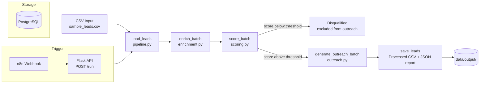

# Lead Generation + Outreach Automation

An end-to-end pipeline that takes raw B2B leads, enriches them, scores them with a weighted AI-style qualification model, and generates personalized outreach emails — with zero manual work between capture and send-ready copy.

Built as a senior-level portfolio project. All data is synthetic; no real companies, contacts, or third-party integrations are used.

---

## Business Value

Manual lead qualification and outreach writing is one of the highest-cost, lowest-leverage tasks on a sales team. Reps typically spend hours per day researching companies, guessing at priority, and hand-writing emails that could be templated and personalized programmatically.

This pipeline automates that entire chain:

- **Enrichment** — every lead gets a tech stack profile and company description automatically, with no manual research.
- **Scoring** — a weighted, explainable model (not a black box) ranks leads 1–10 and tags them hot/warm/cold, so reps work the right accounts first instead of working leads in the order they arrived.
- **Outreach** — each qualified lead gets a subject line and email body personalized to its industry, pain points, and contact seniority, ready for a rep to review and send.
- **Disqualification** — leads below a configurable threshold are automatically filtered out, so no rep time is wasted on poor-fit accounts.

For a sales team processing 50 leads a week, this replaces what is typically 15–20+ hours of manual research and email drafting with a single pipeline run, while producing a documented, auditable reason for every score.

---

## Live Demo

- **Live API:** `[Railway URL — add after deploy]`
- **Demo video (Loom):** `[Loom link — add after recording]`

---

## Architecture



**Flow:**

1. **Ingestion** — `pipeline.load_leads()` reads a CSV of raw leads and validates every row into a typed `Lead` model (Pydantic). Rows that fail validation are logged and skipped, never silently dropped.
2. **Enrichment** (`src/enrichment.py`) — deterministic, rule-based lookup fills `tech_stack` and `company_description` per industry. No external API calls; falls back to generic values for unknown industries so the pipeline never breaks on new data.
3. **Scoring** (`src/scoring.py`) — a weighted composite score (company size 20%, revenue 15%, contact seniority 25%, pain urgency 25%, lead source 15%) produces a 1–10 score, a human-readable reasoning string, and a hot/warm/cold tier. Leads below `MIN_SCORE_THRESHOLD` are marked `DISQUALIFIED` and excluded from outreach.
4. **Outreach generation** (`src/outreach.py`) — builds a personalized subject line and email body per lead, using industry-specific templates, extracted pain-point snippets, and the contact's first name (professional prefixes like "Dr." are stripped automatically).
5. **Persistence** — the fully processed batch is written to `data/output/leads_processed_<timestamp>.csv`, plus a `report_<timestamp>.json` summary (totals, hot/warm/cold counts, disqualified count).
6. **Orchestration** — the whole flow runs either as a CLI (`python -m src.pipeline`) or behind a Flask API (`POST /run`), which n8n calls via webhook so the pipeline can be triggered from any external event (form submission, CRM update, scheduled run, etc.).

Every stage processes leads in batches and isolates per-lead failures — one bad row never aborts the run; it's logged and the lead keeps its last valid state.

---

## Tech Stack

| Component        | Choice                          |
|-------------------|---------------------------------|
| Language           | Python 3.11                    |
| Data validation    | Pydantic v2 + pydantic-settings|
| Data processing    | pandas                          |
| API layer          | Flask                           |
| Automation trigger | n8n (self-hosted, webhook → HTTP call) |
| Database           | PostgreSQL 15                   |
| Logging            | loguru (structured, stdout + rotating file) |
| Testing            | pytest                          |
| Containers         | Docker + docker-compose         |
| Deployment         | Railway (primary), Render (fallback) |

---

## Pluggable AI Pattern: Simulated vs. Real Claude API

Scoring and outreach generation are implemented as **deterministic, rule-based functions** (`score_lead()` in `scoring.py`, `generate_outreach()` in `outreach.py`) rather than live Claude API calls. This is intentional for a portfolio demo:

- Fully reproducible output for testing and grading (same input → same score, every time)
- No API key or cost required to run or evaluate the project
- No dependency on network access during CI/tests

Both functions are documented in their docstrings as the exact swap point for production: replace the scoring/template logic with a single `anthropic.Anthropic().messages.create()` call and parse the structured response. The rest of the pipeline (enrichment, persistence, API, n8n trigger) is unchanged — the AI call is isolated to one function per module, so upgrading from simulated to live AI is a contained, low-risk change.

---

## Project Structure

```
project-1-lead-generation/
├── src/
│   ├── config.py       # Settings (env vars) + loguru setup
│   ├── models.py       # Pydantic models: Lead, ScoringResult, OutreachResult, PipelineResult
│   ├── enrichment.py    # Rule-based tech stack / company description enrichment
│   ├── scoring.py       # Weighted lead scoring + hot/warm/cold tiering
│   ├── outreach.py      # Personalized subject + email body generation
│   ├── pipeline.py      # End-to-end orchestration (CLI entry point)
│   └── api.py            # Flask API — /health and /run endpoints
├── tests/
│   ├── conftest.py
│   ├── test_enrichment.py
│   ├── test_scoring.py
│   └── test_outreach.py
├── data/
│   └── sample_leads.csv   # 50 synthetic B2B leads
├── n8n/
│   └── workflow.json      # Webhook → HTTP Request → success/error branching
├── Dockerfile
├── docker-compose.yml
├── railway.toml
├── requirements.txt
├── pytest.ini
├── .env.example
└── README.md
```

---

## Running Locally (Docker)

**Prerequisites:** Docker + Docker Compose installed.

```bash
# 1. Clone the repo and move into this project
cd project-1-lead-generation

# 2. Create your local env file
cp .env.example .env

# 3. Build and start the pipeline + PostgreSQL
docker compose up --build

# 4. Health check
curl http://localhost:8000/health

# 5. Trigger a full pipeline run against the sample data
curl -X POST http://localhost:8000/run \
  -H "Content-Type: application/json" \
  -d '{"input_file": "data/sample_leads.csv"}'
```

The processed output lands in `data/output/` as a timestamped CSV and JSON report.

**Run without Docker (CLI mode):**

```bash
pip install -r requirements.txt
python -m src.pipeline --input data/sample_leads.csv
```

---

## Running Tests

```bash
pip install -r requirements.txt
pytest tests/ -v
```

26 tests covering enrichment, scoring, and outreach generation — each module includes happy-path, edge-case, and failure-mode coverage (e.g., unknown industries, disqualified leads, simulated exceptions mid-batch).

---

## Sample Data

`data/sample_leads.csv` contains 50 fully synthetic B2B leads across 11 industries (SaaS, Fintech, Healthcare Tech, E-commerce, Logistics, and others), with realistic but fictional companies, contacts, and pain points. No real company or individual data is used anywhere in this project.
