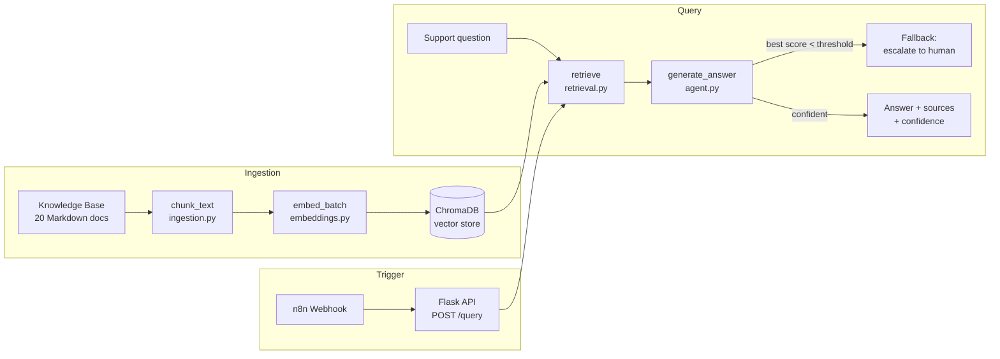

# RAG Support Chatbot

A retrieval-augmented support agent that ingests a product knowledge base, answers customer questions from the actual documentation, and returns every answer with source citations and a confidence score — so first-line support can be automated without hallucinated answers.

Built as a senior-level portfolio project. The knowledge base is a fully synthetic product ("AcmeCRM"); no real company data, no third-party accounts, and no paid API keys are required to run it.

---

## Business Value

Small teams drown in repetitive first-line support: the same "how do I export my contacts?" and "why isn't my calendar syncing?" questions, answered by hand, all day. The answers already exist in the docs — the cost is a human re-reading them and retyping them for every ticket.

This pipeline automates that chain end-to-end:

- **Grounded answers** — the agent only answers from what's actually in the knowledge base. It retrieves the most relevant passages first, then writes the answer from that context, instead of guessing.
- **Citations on every answer** — each response lists the source documents it drew from, so a human can verify it in seconds instead of trusting a black box.
- **Confidence-gated fallback** — when retrieval comes back weak (nothing in the KB really matches), the agent doesn't improvise. It returns a clear "I don't have enough information — want me to escalate to a human?" instead of a confident wrong answer.
- **Idempotent ingestion** — the knowledge base can be re-indexed on every docs update; the vector store is cleared and rebuilt so answers always reflect the latest documentation.

For a business fielding dozens of repeat questions a day, this deflects the bulk of first-line tickets to an agent that cites its sources and knows when to hand off — the two things that make support automation actually safe to ship.

---

## Live Demo

- **Live API:** `[Railway URL — add after deploy]`
- **Demo video (Loom):** `[Loom link — add after recording]`

---

## Architecture



**Flow:**

1. **Ingestion** (`src/ingestion.py`) — loads every `.md` file in `data/knowledge_base/`, splits each into overlapping word-count windows (`chunk_size=120`, `chunk_overlap=20`), embeds every chunk, and stores them in a persistent ChromaDB collection. The collection is cleared and rebuilt on each run, so re-ingestion is idempotent. Empty files are logged and skipped; a missing or empty KB raises a typed `IngestionError` rather than silently producing an empty index.
2. **Embeddings** (`src/embeddings.py`) — a deterministic, offline hashing-trick vectorizer turns text into L2-normalized term-frequency vectors. No model download and no API call, so ingestion and retrieval are fully reproducible and network-free.
3. **Retrieval** (`src/retrieval.py`) — embeds the query, fetches the top-`k` (default 4) chunks from ChromaDB by cosine similarity, converts distance to a 0–1 score, and returns them ranked. Blank queries or an unseeded collection return an empty list (treated as "no context found") instead of raising.
4. **Answer generation** (`src/agent.py`) — selects the strongest, most diverse chunks (at most one per source document, dropping matches that trail the top hit by more than 0.25), synthesizes an answer grounded in that context, and reports the source filenames plus an averaged confidence. If nothing was retrieved or the best match falls below `MIN_CONFIDENCE_THRESHOLD`, it returns a canned escalation answer instead.
5. **Orchestration** — the flow runs behind a Flask API (`POST /ingest` to build the index, `POST /query` to ask a question), which n8n calls via webhook so the chatbot can be wired to any front end (help widget, Slack, email intake, etc.).

Each stage isolates its own failures behind typed exceptions (`IngestionError`, `RetrievalError`, `AgentError`) — a bad query or a transient store error is logged and surfaced cleanly, never swallowed.

---

## Tech Stack

| Component        | Choice                          |
|-------------------|---------------------------------|
| Language           | Python 3.11                    |
| Data validation    | Pydantic v2 + pydantic-settings|
| Vector store       | ChromaDB (self-hosted, embedded/persistent) |
| Embeddings         | Deterministic hashing vectorizer (offline, no external model) |
| API layer          | Flask                           |
| Automation trigger | n8n (self-hosted, webhook → HTTP call) |
| Logging            | loguru (structured, stdout + rotating file) |
| Testing            | pytest                          |
| Containers         | Docker + docker-compose         |
| Deployment         | Railway (primary), Render (fallback) |

---

## Pluggable AI Pattern: Simulated vs. Real Claude API

Two pieces are implemented as **deterministic, offline stand-ins** for their production equivalents, so the demo runs with zero cost, zero API keys, and fully reproducible output:

- **Embeddings** (`embed_text` / `embed_batch` in `embeddings.py`) — a hashing-trick vectorizer instead of a hosted embeddings model. Every other module depends only on these two signatures, so swapping in a real embeddings API (or a local `sentence-transformers` model) is a one-file change.
- **Answer generation** (`_synthesize_answer` in `agent.py`) — an extractive synthesis from the retrieved chunks instead of a live Claude call. Its docstring marks the exact swap point: replace the body with `anthropic.Anthropic().messages.create(...)`, passing the query and retrieved chunk texts as context. Retrieval, citation, confidence gating, and the API layer are all unchanged.

Because the AI touchpoints are isolated to one function each, upgrading from simulated to live AI is a contained, low-risk change — the RAG plumbing around it (chunking, vector search, source citation, fallback logic) is already production-shaped.

---

## Project Structure

```
project-2-support-chatbot-rag/
├── src/
│   ├── config.py       # Settings (env vars) + loguru setup
│   ├── models.py       # Pydantic models: DocumentChunk, RetrievedChunk, AgentResponse, IngestionResult
│   ├── embeddings.py   # Deterministic offline hashing vectorizer + cosine similarity
│   ├── ingestion.py    # Load .md docs → chunk → embed → store in ChromaDB
│   ├── retrieval.py    # Embed query → top-k vector search → ranked chunks
│   ├── agent.py        # Context selection + grounded answer + confidence + citations
│   ├── exceptions.py   # Typed errors: IngestionError, RetrievalError, AgentError
│   └── api.py          # Flask API — /health, /ingest, /query
├── tests/
│   ├── conftest.py
│   ├── test_ingestion.py
│   ├── test_retrieval.py
│   └── test_agent.py
├── data/
│   └── knowledge_base/   # 20 synthetic AcmeCRM docs (.md)
├── n8n/
│   └── workflow.json     # Webhook → HTTP Request → success/error branching
├── Dockerfile
├── docker-compose.yml
├── railway.toml
├── requirements.txt
├── pytest.ini
├── .env.example
└── README.md
```

---

## Running Locally (Docker)

**Prerequisites:** Docker + Docker Compose installed.

```bash
# 1. Clone the repo and move into this project
cd project-2-support-chatbot-rag

# 2. Create your local env file
cp .env.example .env

# 3. Build and start the chatbot API
docker compose up --build

# 4. Health check
curl http://localhost:8001/health

# 5. Build the vector store from the knowledge base (run once)
curl -X POST http://localhost:8001/ingest

# 6. Ask a question
curl -X POST http://localhost:8001/query \
  -H "Content-Type: application/json" \
  -d '{"question": "How do I export my contacts from AcmeCRM?"}'
```

The response includes the answer, the list of source documents it cited, and a confidence score.

**Run without Docker (CLI ingestion + tests):**

```bash
pip install -r requirements.txt

# Build the index directly
python -m src.ingestion

# Start the API
python -m src.api
```

---

## Running Tests

```bash
pip install -r requirements.txt
pytest tests/ -v
```

16 tests covering ingestion (chunking, empty/missing KB handling, idempotent re-indexing), retrieval (top-k ranking, empty query, unseeded collection), and answer generation (grounded answers, source citation, low-confidence fallback) — each module includes happy-path, edge-case, and failure-mode coverage.

---

## Sample Data

`data/knowledge_base/` contains 20 fully synthetic Markdown documents for a fictional CRM product, "AcmeCRM" — covering onboarding, billing, contact management, the deal pipeline, integrations, security, troubleshooting, an FAQ, and more. No real product documentation or company data is used anywhere in this project.
