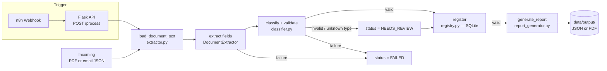

# Document Processing & Invoicing

An end-to-end pipeline that ingests invoices, receipts, and purchase orders — as real PDFs or inbound emails — extracts their structured fields, classifies each document, validates it, persists it to a queryable registry, and generates an output report. Malformed documents are routed to review instead of crashing the batch.

Built as a senior-level portfolio project. All sample documents are fully synthetic; no real vendor, customer, or financial data is used, and the demo runs with zero API keys or cost.

---

## Business Value

Accounts-payable and bookkeeping teams spend hours keying the same fields off every invoice — number, date, vendor, line items, total — then filing each document somewhere it can be found again. It's high-volume, error-prone, and pure overhead.

This pipeline automates that chain:

- **Extraction** — pulls the structured fields (invoice number, dates, vendor, customer, line items, subtotal, tax, total) out of each document automatically, whether it arrived as a PDF attachment or the body of an email.
- **Classification & validation** — detects the document type (invoice / receipt / purchase order) and checks it against the minimum required fields for that type. A document that's missing critical data is flagged, not silently accepted.
- **Review routing** — anything that can't be validated (missing fields, unknown type, unrelated email) is marked `needs_review` and set aside for a human, so bad data never flows downstream as if it were clean.
- **Queryable registry** — every processed document is stored in a registry that can be queried by status, type, and date range — the audit trail AP teams need, without a spreadsheet.

For a team processing dozens of documents a day, this replaces manual data entry and filing with a single batch run, while guaranteeing that only validated documents produce output and everything questionable lands in a review queue.

---

## Live Demo

- **Live API:** `[Railway URL — add after deploy]`
- **Demo video (Loom):** `[Loom link — add after recording]`

---

## Architecture



**Flow:**

1. **Input normalization** (`load_document_text` in `extractor.py`) — collapses three input channels into plain text: a real PDF attachment (parsed with `pypdf`), a simulated inbound email (`.json` with a `body` field), or raw text passed directly. A recognized file that can't be parsed raises a typed `ExtractionError`.
2. **Extraction** (`src/extractor.py`) — a pluggable `DocumentExtractor` interface pulls structured fields into a typed `ExtractionResult` (Pydantic): invoice number, dates, vendor, customer, line items, subtotal, tax, total. The default `RegexDocumentExtractor` is deterministic and offline; `ClaudeDocumentExtractor` documents the production path and is selectable via `EXTRACTION_BACKEND`.
3. **Classification & validation** (`src/classifier.py`) — infers the document type from keywords (purchase order / receipt / invoice, checked most-specific first) and validates it against the required fields for that type. Missing data yields `is_valid=False` with the exact `missing_fields` listed — an expected outcome for a malformed document, not an exception.
4. **Persistence** (`src/registry.py`) — every document is written to a SQLite-backed registry as JSON, with indexed columns for status, type, and date, so the registry can be queried by any combination of those without loading it all into memory. Writes are idempotent (upsert by id).
5. **Report generation** (`src/report_generator.py`) — validated documents produce an output report, JSON by default or a one-page PDF summary (`reportlab`) via `REPORT_FORMAT`. Documents routed to `needs_review` are registered but not reported.
6. **Orchestration** (`src/pipeline.py`) — runs each document through extract → classify → register → report. **Every stage's failure is caught and recorded on the document itself** (`status=FAILED`/`NEEDS_REVIEW`, `error_message` set) rather than raised, so one bad document never aborts the batch. Runs as a CLI (`python -m src.pipeline`) or behind a Flask API (`POST /process`) that n8n calls via webhook.

---

## Tech Stack

| Component        | Choice                          |
|-------------------|---------------------------------|
| Language           | Python 3.11                    |
| Data validation    | Pydantic v2 + pydantic-settings|
| PDF parsing        | pypdf                           |
| PDF generation     | reportlab                       |
| Registry           | SQLite (indexed by status/type/date) |
| API layer          | Flask                           |
| Automation trigger | n8n (self-hosted, webhook → HTTP call) |
| Logging            | loguru (structured, stdout + rotating file) |
| Testing            | pytest                          |
| Containers         | Docker + docker-compose         |
| Deployment         | Railway (primary), Render (fallback) |

---

## Pluggable AI Pattern: Simulated vs. Real Claude API

Field extraction is implemented behind the **`DocumentExtractor` interface**, with two backends selectable via `EXTRACTION_BACKEND`:

- **`mock` (default)** — `RegexDocumentExtractor`, a deterministic regex extractor over the document's plain text. Zero cost, no API key, fully reproducible output for testing and grading. This is what the demo runs.
- **`claude`** — `ClaudeDocumentExtractor`, the documented production path. In production its `extract()` sends the raw text (or the PDF as a document content block) to Claude with a tool-use schema matching `ExtractionResult`, and parses the structured JSON response. It's intentionally left unimplemented (raises `NotImplementedError`) so the demo can never incur API cost — wiring up `anthropic.Anthropic().messages.create(...)` is the single contained change to go live.

Because extraction is isolated behind the factory (`get_extractor`), the rest of the pipeline — classification, validation, registry, reporting, API, n8n trigger — is identical regardless of backend. Upgrading from simulated to real AI extraction is a one-file, low-risk swap.

---

## Project Structure

```
project-3-document-processing/
├── src/
│   ├── config.py            # Settings (env vars) + loguru setup
│   ├── models.py            # Pydantic models + DocumentType / ProcessingStatus enums
│   ├── extractor.py         # Input normalization + pluggable DocumentExtractor (regex / Claude)
│   ├── classifier.py        # Type detection + required-field validation
│   ├── registry.py          # SQLite registry — register + query by status/type/date
│   ├── report_generator.py  # JSON (default) or PDF output report
│   ├── pipeline.py          # End-to-end orchestration (CLI entry point)
│   ├── exceptions.py        # Typed errors per stage
│   └── api.py               # Flask API — /health, /process, /documents, /documents/<id>
├── tests/
│   ├── conftest.py
│   ├── test_extractor.py
│   ├── test_classifier.py
│   ├── test_registry.py
│   └── test_pipeline.py
├── data/
│   └── incoming/            # 10 synthetic documents (4 real PDFs + 6 email JSON)
├── scripts/
│   └── generate_synthetic_data.py   # Regenerates the sample PDFs/emails
├── n8n/
│   └── workflow.json        # Webhook → HTTP Request → success/error branching
├── Dockerfile
├── docker-compose.yml
├── railway.toml
├── requirements.txt
├── pytest.ini
├── .env.example
└── README.md
```

---

## Running Locally (Docker)

**Prerequisites:** Docker + Docker Compose installed.

```bash
# 1. Clone the repo and move into this project
cd project-3-document-processing

# 2. Create your local env file
cp .env.example .env

# 3. Build and start the pipeline API
docker compose up --build

# 4. Health check
curl http://localhost:8002/health

# 5. Process every document in data/incoming/
curl -X POST http://localhost:8002/process \
  -H "Content-Type: application/json" \
  -d '{}'

# 6. Query the registry (e.g. everything that needs review)
curl "http://localhost:8002/documents?status=needs_review"
```

Reports for validated documents land in `data/output/` as timestamped JSON (or PDF, if `REPORT_FORMAT=pdf`).

**Run without Docker (CLI mode):**

```bash
pip install -r requirements.txt
python -m src.pipeline --input-dir data/incoming
```

---

## Running Tests

```bash
pip install -r requirements.txt
pytest tests/ -v
```

17 tests covering extraction (PDF/email/raw-text loading, field + line-item parsing), classification (type detection, missing-field validation), the registry (register, fetch, filtered queries), and the pipeline (happy path, `needs_review` routing, per-document failure isolation) — each module includes happy-path, edge-case, and failure-mode coverage.

---

## Sample Data

`data/incoming/` contains 10 fully synthetic documents: 4 real PDFs generated with `reportlab` (invoices, a receipt, a purchase order) and 6 simulated inbound emails as JSON. The set deliberately mixes valid documents with an incomplete invoice and an unrelated email, so the pipeline's `needs_review` routing is exercised end-to-end. `scripts/generate_synthetic_data.py` regenerates the set. No real vendor, customer, or financial data is used anywhere in this project.
